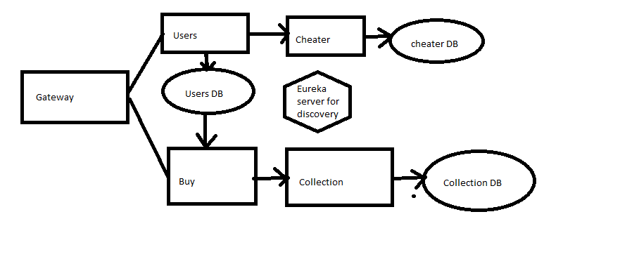

setup before starting the project:

- mvn installed on the computer
- rabbitMQ installed(erlang needs to be installed for rabbitMQ to be installed)
to get the database up and running:
- docker (docker desktop) installed
- make sure docker engine is running
- run "docker compose up -d" in terminal while being in the pg3402 folder
- go to localhost:5050 and make the password: "pass"
- go to "add new server"
- name the new server "pg3402"
- under the connection tab name the host name/address "postgres"
- in the same tab make the username "pg3402" and password "pass", then click save
- under the servers tab on the left right-click "Databases" and create a new database "users"
- do the same to make a database "cheaters", and a database "collection"

to start the project:
- first start the eureka-server
- then any other service can be started, user relies on synchronous communication with cheater so both needs to be running to test user
- all services can be started by running their <service>Application file

this project was build on java 17 azul.

to check the project endpoints:
for the user endpoint use either
"localhost:<portnr(default is 8081)>/api/users" or the gateway port(default 9000) "localhost:9000/users/api/users"
use postman post as json with this scrip:
{
    "username": "testers",
    "password": "testinger"
}
"testers" and "testinger" can be changed to change the name of the user.

to use the buy endpoint use either
"localhost:<portnr(default is 8083)>/api/buy/<userId of the user that is buying, check the database if you are unsure of the user IDs>"
example: localhost:8083/api/buy/1
or "localhost:9000/buy/api/buy/<userId>" to use the gateway.

to search in a database, rightclick the database you want to query and select "query Tool"

an overview:
the project consist of a eureka server for service discovery and health checks, a gateway to route incoming calls and 4 microservices that use both synchronous and asynchronous communication.
the user module checks with the cheater module to see weather a user is a cheater, while creating the user.
the cheater module is predetermined for the userId if the user is a cheater now, but can be built to check various databases and user behaviour in a real setting.
the buy module takes a user and checks if the user has enough credits to buy a "pack of cards" then it sends a request to the collection module to add a new pack to that user.
the collection module takes a request from the buy module and opens a new "pack of cards" for the user and adds them to that users collection.
the project has three databases, one for the users that keeps track of users, their password and currency, one for the cheater module that for now keeps track of requests to check if users are cheaters, and a collection database that keeps track of the cards users collect.

user stories:
- a user can create a new user.
- a user can buy a new "pack" and add five random cards to their collection.

diagram:

in a real environment I would create a postgres service for each microservice in the docker-compose.yml, but due to limited space I have chosen for all the microservices to use the same postgres service.